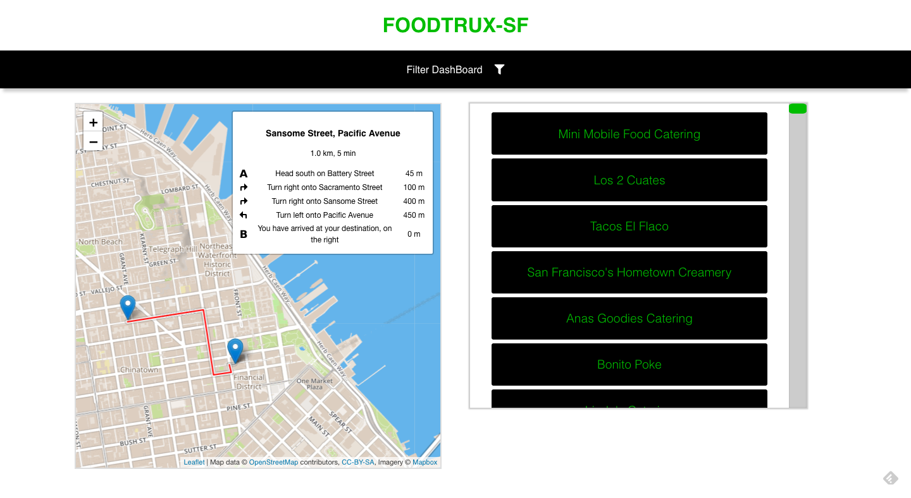

FoodTrux-SF
=============

A real-time service that tells the user what types of food trucks might be found near a specific location on a map.
-----------

It uses **LeafletJS** for the interactive map, **MapBox API** for the map tiles, **leaflet routing machine** plugin for navigation routing, made with **React**, and data layer is managed in **Redux**. 

Project Idea came from [here](https://github.com/team-gary/code-challenge).
### Features
- [x] Use downtown San Francisco as default location
- Change location data regardless of actual location by:
  - [x] dragging the marker or 
  - [ ] entering address manually
- [x] List of trucks returned in the list is within the given radius
- [ ] "Click for more info" for each individual truck button/interface
- [ ] Navigation Routes from one point to another
- [ ] Enter an address for start and get navigation steps to selected truck
- [ ] show all trucks on map
  - [ ] filter them in filter mode
- [ ] Change search radius for Food Trucks
- [ ] Autocomplete search by food type
- [ ] Sort and filter by food types

### Technologies/Languages:
- [JavaScript](https://developer.mozilla.org/en-US/docs/Web/JavaScript)
- [React](https://reactjs.org)
- [React-Redux](https://react-redux.js.org)
- [LeafletJS Open source interactive maps](https://leafletjs.com/)
  - [Leaflet Routing Machine Plugin (for navigation+)](http://www.liedman.net/leaflet-routing-machine)
- [MapBox API and map tiles](https://docs.mapbox.com/api/maps/)

### Sources:
- [SF food truck API](https://data.sfgov.org/Economy-and-Community/Mobile-Food-Facility-Permit/rqzj-sfat)
- [Haversine Formula (for relative distance on earth's surface in miles)](https://en.wikipedia.org/wiki/Haversine_formula)
  - [additional info](https://www.movable-type.co.uk/scripts/latlong.html)
